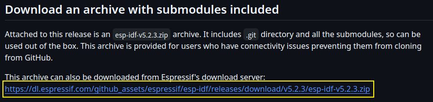
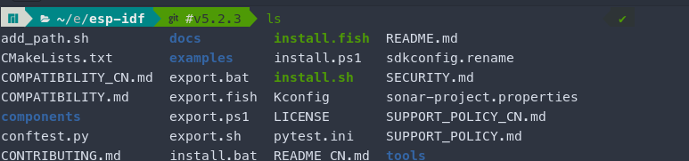
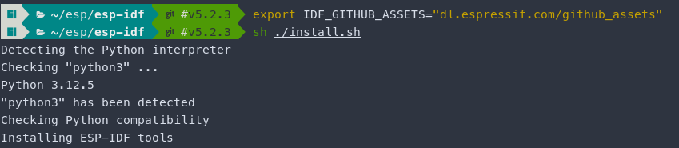
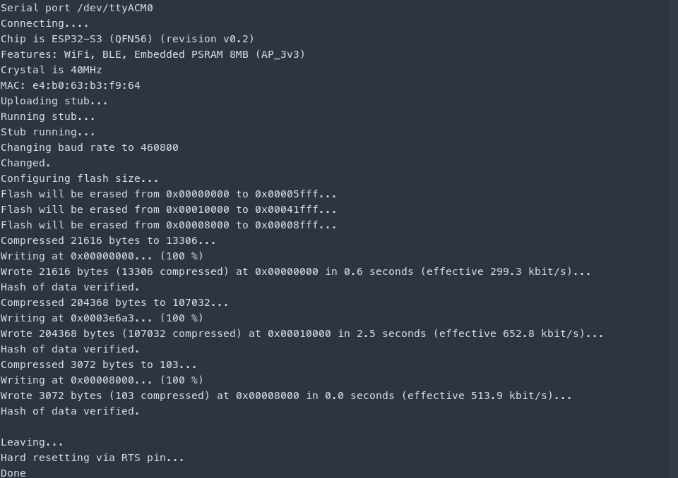
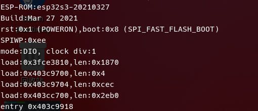
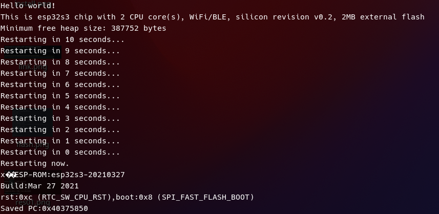

# Manjaro-Linux 配置esp32-3开发环境

## 01. Manjaro 安装依赖软件

```shell
sudo pacman -S --needed \
    gcc git make flex bison gperf \ 
    python-pip cmake ninja ccache \
    dfu-util libusb
```

## 02. 安装 ESP-IDF

### 下载安装包并解压

从releases界面`https://github.com/espressif/esp-idf/releases`中找到下载链接：



下载完成后解压到`~/esp/`下并改名为`esp-idf`，进入该解压目录下

```shell
cd ~/esp/esp-idf/
```


### 安装esp-idf

设置环境变量更换下载源，确保由中国服务器进行下载。

```shell
export IDF_GITHUB_ASSETS="dl.espressif.com/github_assets"
```

运行安装脚本。

```shell
cd ~/esp/esp-idf/
sh ./install.sh
```

### 设置环境变量

- 不推荐：~~临时设置环境变量，每次打开终端需要重新执行~~
  
  ```shell
  cd ~/esp/esp-idf/
  . ~/esp/esp-idf/export.sh
  ```

- 推荐：自动设置环境变量, 并设置别名`idf`.
  
  ```shell
  # 根据所使用的
  sudo echo ". ~/esp/esp-idf/export.sh >> /dev/null " >> ~/.zshrc
  sudo echo "alias idf=\"idf.py\" " >> ~/.zshrc
  ```

## 03. 例程测试

### 配置项目

复制`esp-idf`自带例程项目`hello_world`

```shell
cd ~/esp/
cp -r ~/esp/esp-idf/examples/get-started/hello_world/ .
```

配置项目目标芯片组

```shell
cd ~/esp/hello_world/
idf.py set-target esp32-s3  # 选择合适芯片名称
```

可选项：修改设备配置

```shell
idf.py menuconfig
```

### 编译

```shell
cd ~/esp/hello_world/
idf.py build
```

### 烧录

1. 找到烧录设备
   
   首先不连接esp32设备，运行如下命令输出原有设备
   
   ```shell
   ls /dev/tty* >> tmp01.txt
   ```

       连接设备后，再次查看已有设备，对比两次设备列表，找出新连接设备`ttyACM0`

2. 修改设备读写执行权限
   
   ```shell
   sudo chmod 667 /dev/ttyACM0
   ```

3. 烧录
   
   ```shell
       idf.py flash -p /dev/ttyACM0
   ```
	
### 监控运行情况

使用如下命令打开串口监视器

```shell
idf.py monitor
```




### 擦除设备flash

```shell
idf.py erase_flash -p /dev/ttyACM0
```

## References

[^1]: https://b23.tv/4nfs7z9
