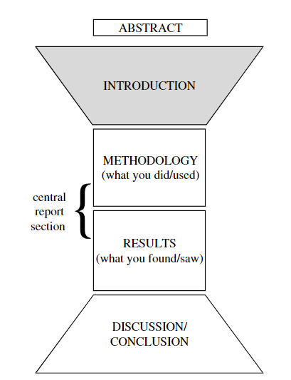

> [!NOTE] chapter 1.1 - 1.2 

## 文章结构 Structure

> The fig is symmetrical because many of the things you need to do in the Introduction are done — in reverse order — in the Discussion/Conclusion.

> The shape represents the way information is ordered in the Introduction and the Discussion/Conclusion: in the Introduction you start out by being fairly general and gradually narrow your focus, whereas the opposite is true in the Discussion/Conclusion.

## 时态 Tense

- 一般现在时 Present Simple tense
  - 在Intro中, `一般现在时`用以描述公认的事实或公理(但是否是事实往往取决于作者).
  - 在Conclusion中, `一般现在时`用以表示结论足够Strong, 可以作为公理.
- 现在进行时 Present Continuous tense
- 一般过去时 Past Simple Perfect
  - 关注于过去某个瞬间
- 过去完成时 Past Present Perfect
  - 过去一段时间内...

## Sentence connection (Signalling language)

句子之间的衔接能帮助读者更好的理解内容.

**衔接方式:**

- 在不同句子中重复相同内容.
- 用代词或替代指代上句中的内容, 将句子连接在一起.
- 用`;`或`从句` 将两个句子连接起来.
- 使用连接词指明句子间的逻辑关系(signalling sentence connector).

**signalling language:**

- 原因CAUSE
  
  - 连接短语: `due to` `on account of` `in view of`
  - 连接句子: `as` `because` `since`

- 结果RESULT
  
  - `therefore`, `consequently`, `hence`.`
  
  - `which is why`, `so`, `as a result of`. 
    
    > 用`so`开头表达结果不够正式

- 矛盾CONTRAST/差别DIFFERENCE
  
  - `however`, `whereas`,`but`.
  - `on the othe hand`, `while`,`by contrast`.

- 意外UNEXPECTEDNESS
  
  - `although`,`even though`, `though`
  - `despite`,`in spite of`,`regardless of`,`notwithstanding`
  - `nevertheless`,`however`,`yet`,`nonetheless`,`even so`

- 额外/ADDITION
  
  - `in addition`,`moreover`,`furthermore`,`apart from that/which`
  - `also`, `secondly`,`in the second place`,`what is more`

## 主动/被动

主语:

- 只能使用`we`表示研究团队
- 使用`it`指代一般人类, 不使用`we`.
- 使用被动句代替`we`
- 使用虚拟代替`I/we`, 如`this article` `the pressent paper`(常用)

分段 paragraphing:

- 从视觉上快速掌握全文
- 段落不可过长或过短.
- 每段开头为中心句, 其余部分均是对其的详细展开, 也因此不能过于偏离中心.
  
  
  
  
  
  

## 语法 Grammar

## Introductions

需要准确的知道做了什么、得到了什么结果, 一般在文章最后写.

Model:

- 一般如何开始Intro
- Intro中的信息种类与顺序
- 一般如何结束Intro

## Methodology

## Results

## Discussion/Conclution

## Abstract & Title

## 词汇

attempt, conduct, interpret, evaluate, determine, implement, formulate, classify, correlate, enhance

## References

- Science Research Writing for Non-Native Speakers of English
